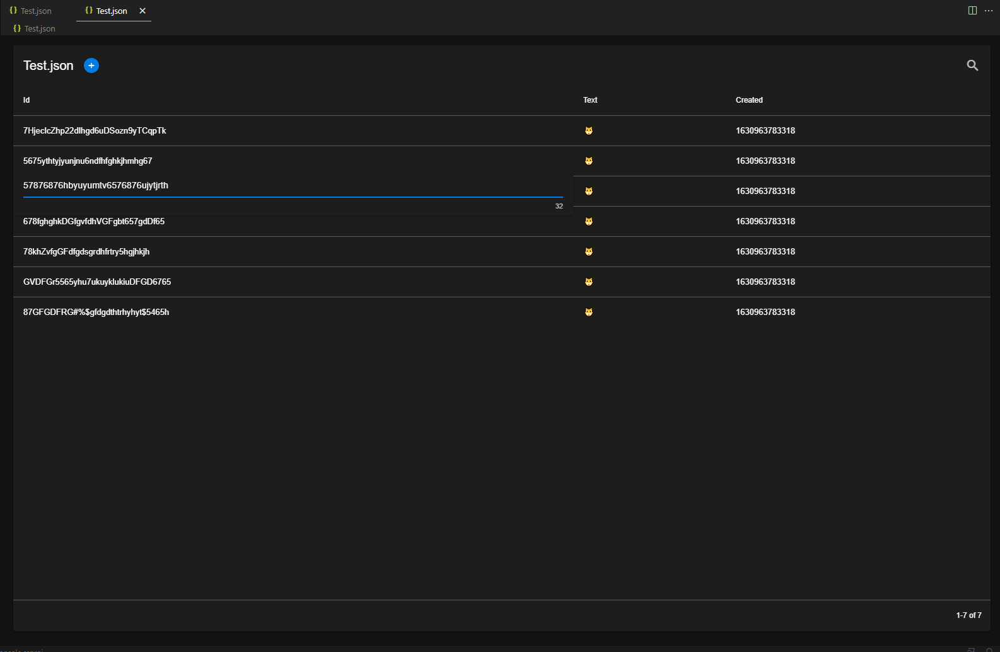

# JSON Table Editor

Demonstrates [JSON Grid Editor](https://github.com/SoloHam/json-table) using a custom editor:

- Provides a custom editor for `.json` files
- Currently, it extracts the first element from the JSON that is an array
- The JSON Table Editor can be invoked from the context menu of a JSON file, by choosing "JSON Table Editor" in the Open With options
- The table supports sorting, filtering and inline editing
- Clicking the plus icon will add a new row at the bottom of the table, the new row is a copy of the last element